# Network Security Groups (NSGs) and Inspecting Traffic Between Azure Virtual Machines

In this project, I explored how to monitor network traffic between Azure Virtual Machines using Wireshark and experimented with Network Security Groups (NSGs) to control and observe the traffic.

## Environments and Technologies Used

- **Microsoft Azure** (Virtual Machines/Compute)
- **Remote Desktop Protocol (RDP)**
- **Command-Line Tools** (PowerShell, SSH)
- **Network Protocols** (ICMP, SSH, DHCP, DNS, RDP)
- **Wireshark** (Protocol Analyzer)

## Operating Systems Used

- **Windows 10 (21H2)**
- **Ubuntu Server 20.04**

## High-Level Steps

1. Create Azure Virtual Machines (Windows 10 and Ubuntu).
2. Observe ICMP Traffic using Wireshark.
3. Configure Network Security Groups (NSGs) to control and filter traffic.
4. Capture traffic for SSH, DHCP, DNS, and RDP using Wireshark.

## Detailed Steps and Observations

### Part 1: Setting Up Virtual Machines in Azure

- **Create a Resource Group:**
  - Navigate to the [Azure Portal](https://portal.azure.com).
  - Create a resource group, e.g., `Network-Security-Lab`.
  - Choose **Canada Central** as the region (since I'm based in Winnipeg).
  
  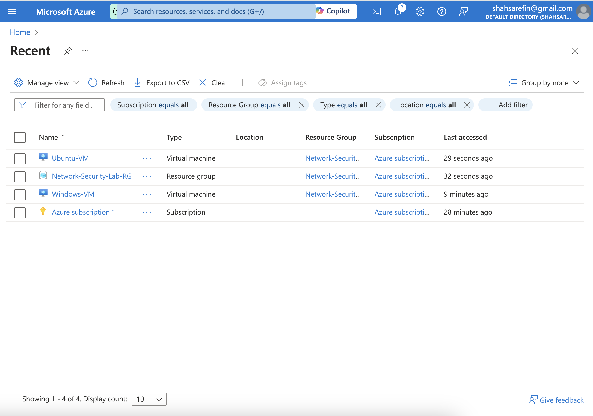

- **Create a Windows 10 Virtual Machine (VM):**
  - Use the previously created resource group.
  - Configure a new Virtual Network (VNet) and Subnet for the VM.
  
  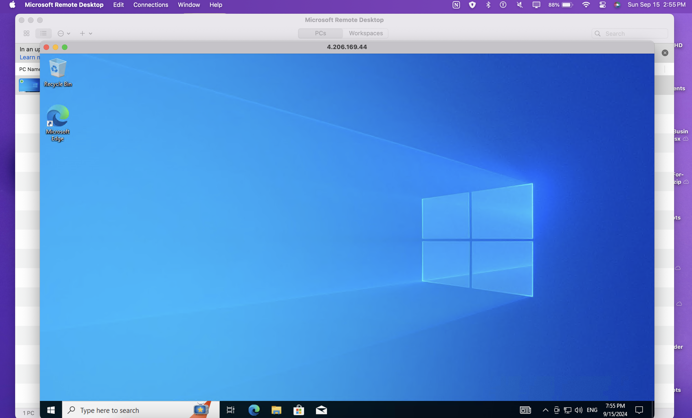

- **Create an Ubuntu Server VM:**
  - Select the same resource group and virtual network.
  - Set up SSH login with username and password.

### Part 2: Observing ICMP Traffic

- **Access Windows 10 VM via Remote Desktop:**
  - From the Azure portal, connect to the Windows VM using RDP.

- **Install Wireshark on Windows VM:**
  - Download and install Wireshark to capture network traffic.
  - Start capturing packets and apply an ICMP filter.

  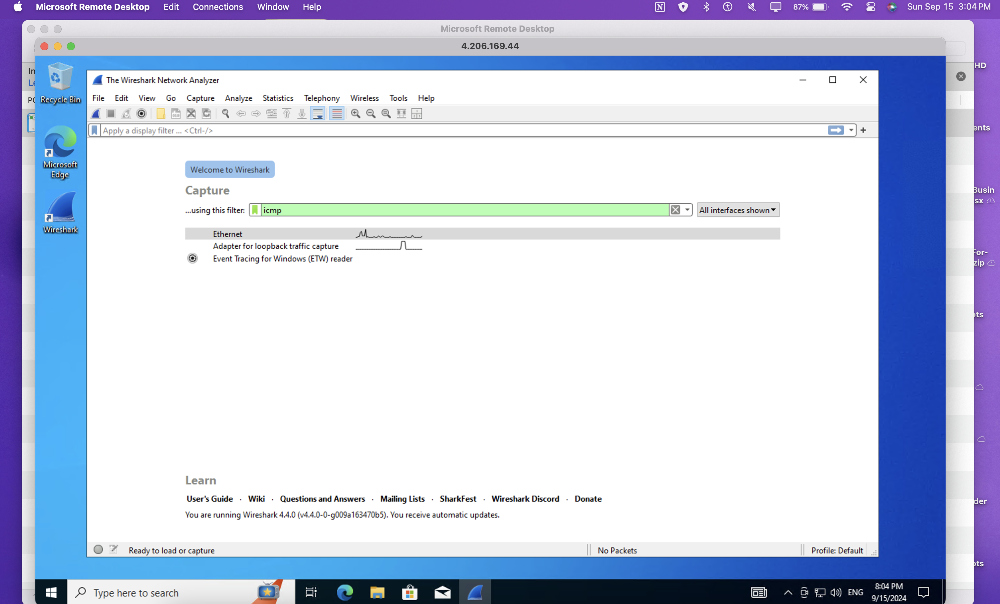

- **Ping the Ubuntu VM:**
  - Retrieve the private IP of the Ubuntu VM.
  - From the Windows VM, use `ping <Ubuntu IP>` in Command Prompt.
  
  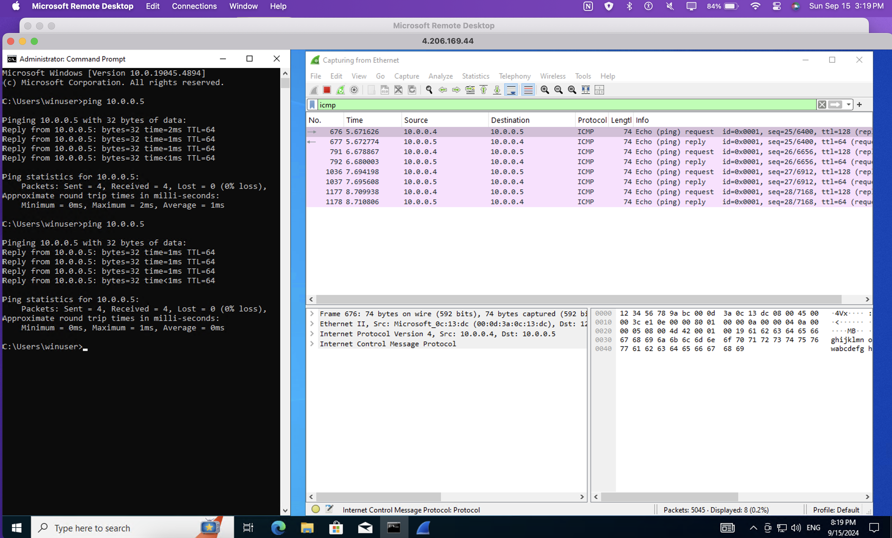

- **Ping a Public Website:**
  - Use `ping www.google.com` and observe the traffic in Wireshark.
  
  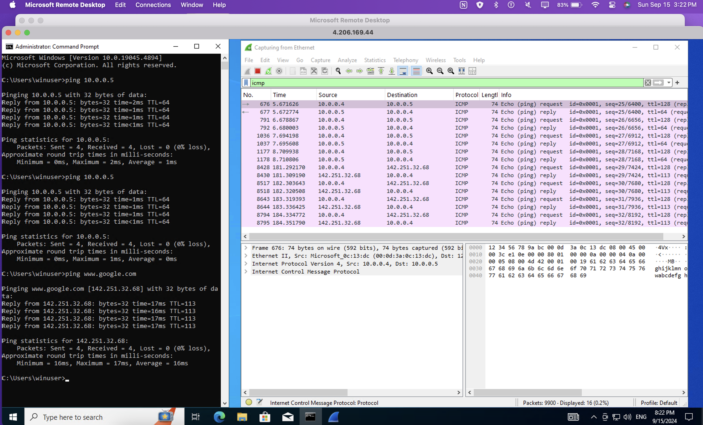

### Part 3: Configuring Network Security Groups (NSGs)

- **Disable ICMP Traffic:**
  - Start a continuous ping from the Windows VM to the Ubuntu VM.
  - Go to the NSG for the Ubuntu VM in Azure and block inbound ICMP traffic.
  
  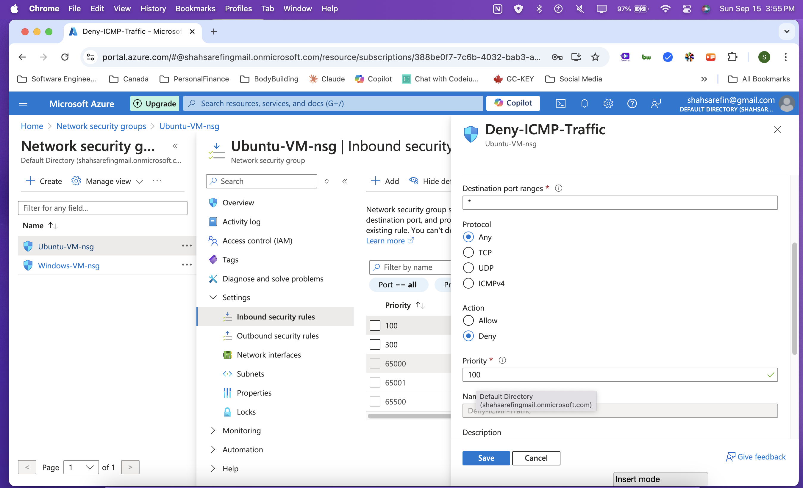

  - Observe how the ping fails, and Wireshark shows no ICMP replies.

  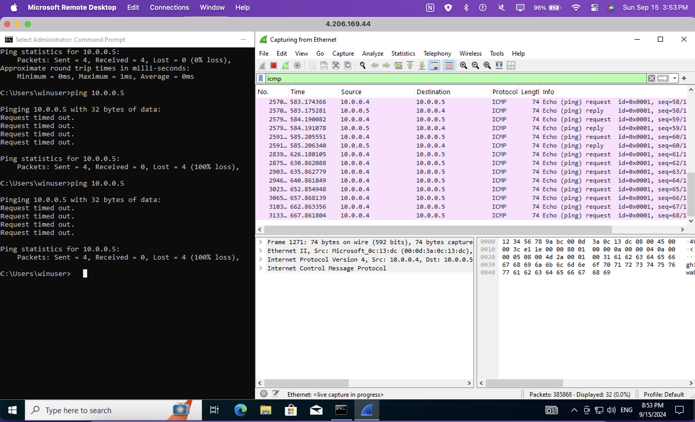

- **Re-enable ICMP Traffic:**
  - Allow ICMP traffic again through the NSG.
  - Watch how the pings resume and traffic flows again in Wireshark.
  
  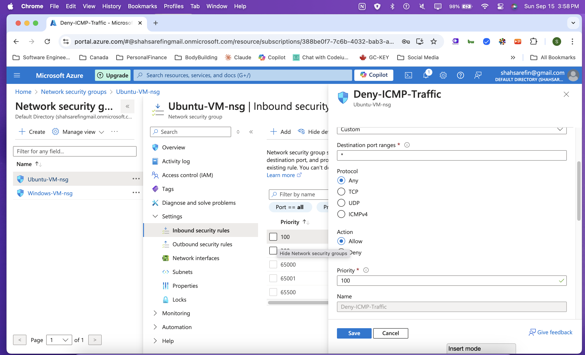

  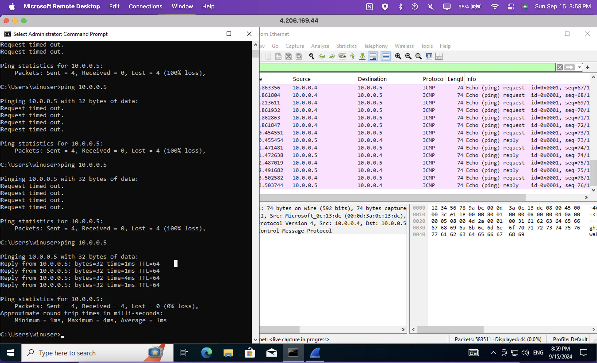

### Part 4: Observing SSH, DHCP, DNS, and RDP Traffic

- **SSH Traffic:**
  - From the Windows VM, SSH into the Ubuntu VM using its private IP.
  - Filter for SSH traffic in Wireshark to observe secure traffic.
  
  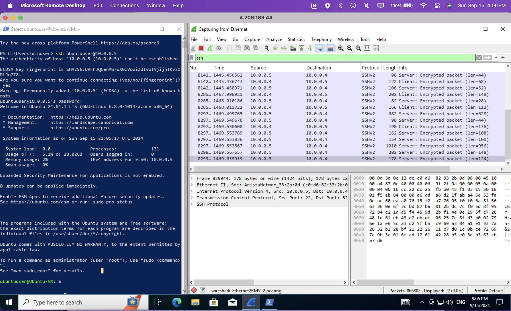

- **DHCP Traffic:**
  - On the Windows VM, run `ipconfig /renew` in Command Prompt to request a new IP.
  - Filter for DHCP packets and observe the traffic exchange.
  
  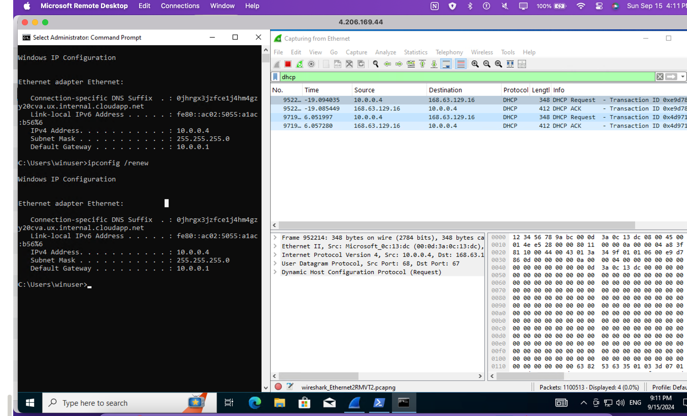

- **DNS Traffic:**
  - Use `nslookup` to query DNS for websites like `google.com`.
  - Observe the DNS requests and responses in Wireshark.
  
  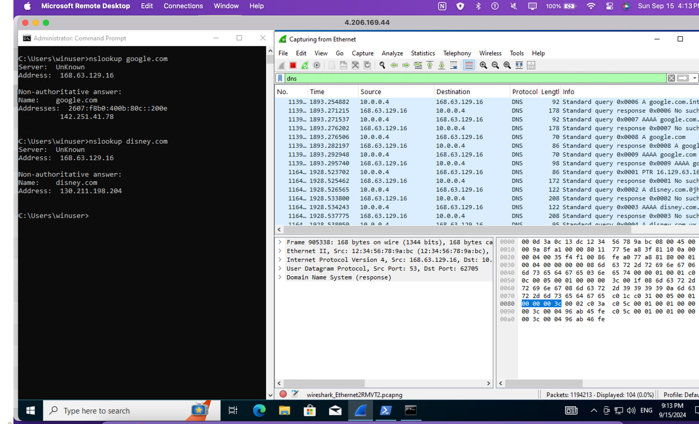

- **RDP Traffic:**
  - Filter for RDP traffic in Wireshark (`tcp.port == 3389`).
  - Observe continuous traffic as the RDP session streams the desktop.
  
  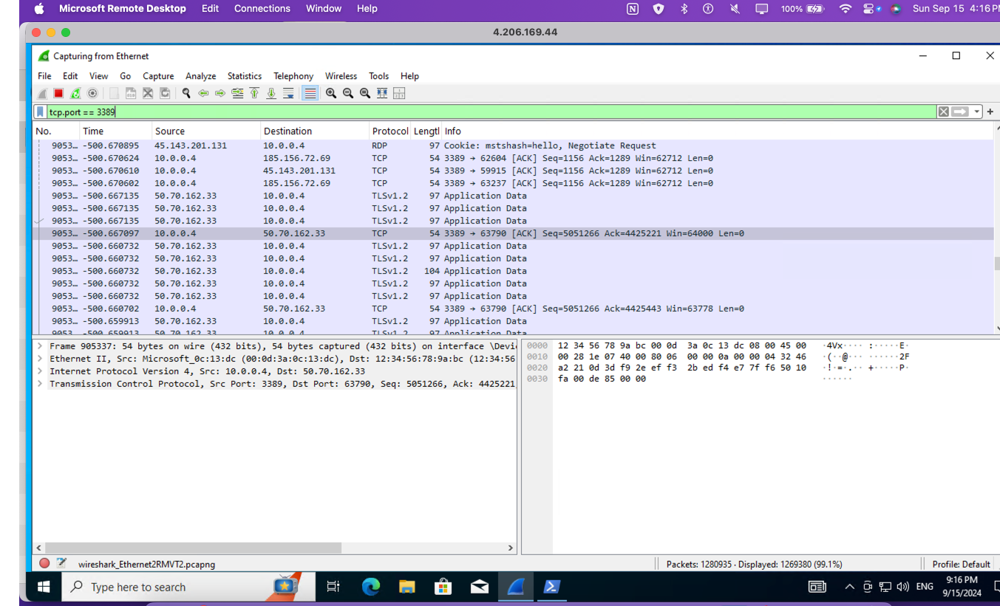

## Lab End Screenshot

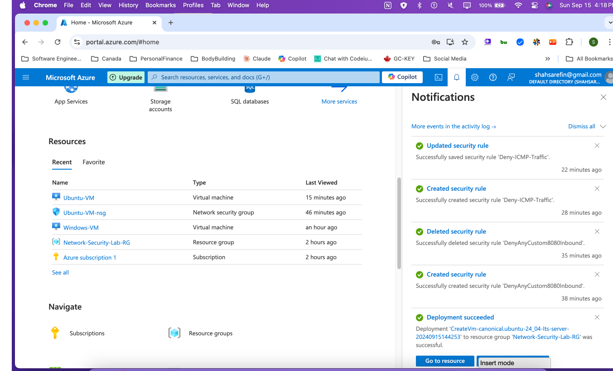

## Lab Cleanup

- Close the Remote Desktop session.
- Delete the Resource Group and verify all resources are removed.
